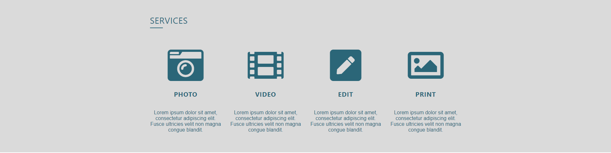
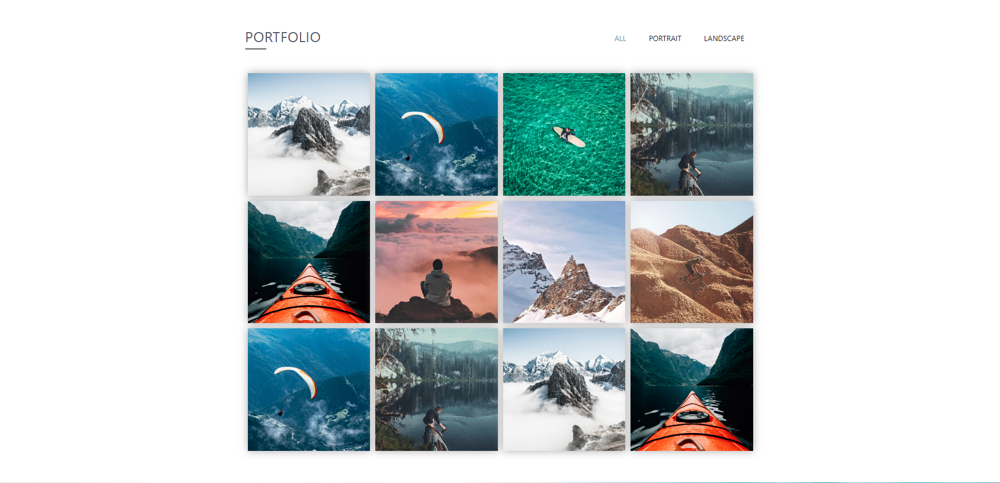
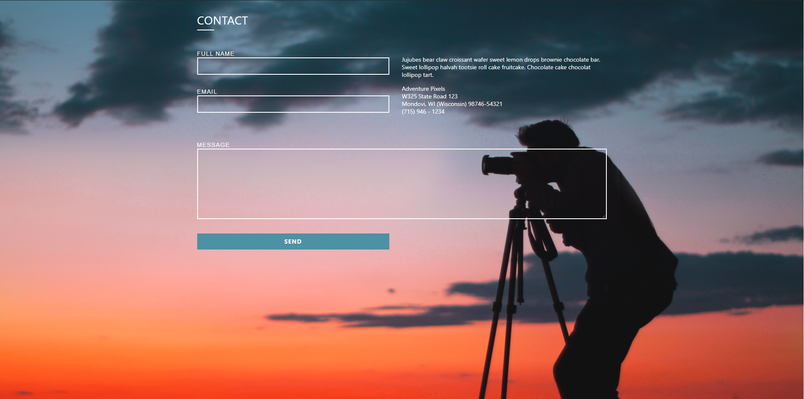
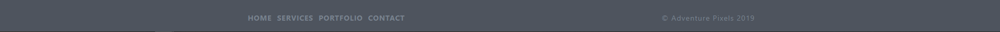

# Adventure Pixels

### This is a final individual project for Vilnius Coding School Bootcamp course.

A single page landing website for photography services created using HTML, SCSS, JavaScript + jQuery pluggins (Fancybox + Owl Carousel), PHP and WordPress.

## Features

- Responsive layout
- Drop down burger menu
- Icon animations
- Image gallery
- Social media navigation
- Contact form

Try out this website live:  https://mskirmantas.github.io/AdventurePixels/

